# workshop-Multivariate-analysis
# Aim:
To Perform Bivariate/Multivariate Analysis

# Algorithm:
1.Read the given data 

2.Get information from the data

3.Perform the Bivariate/Multivariate Analysis

4.Save the clean data to File

# Code
```
Developed by: Akshayaa M  
Registration Number: 212222230009
import pandas as pd
import numpy as np
import seaborn as sns
import matplotlib.pyplot as plt
df=pd.read_excel('FlightInformation.xlsx')
df
df.head()
df.info()
df.describe()
df.isnull().sum()
df.dtypes
# Numerical and Numerical
# Scatterplot
sns.scatterplot(df['Airline'])
sns.scatterplot(df['Destination'])
# Numerical and Categorical
# Barplot
sns.barplot(x=df['Airline'],y=df['Price'],data=df)
sns.barplot(x=df['Destination'],y=df['Price'],data=df)
# Boxplot
sns.boxplot(x=df['Price'],y=df['Source'],data=df)
sns.boxplot(x=df['Price'],y=df['Duration'],data=df)
# Displot
sns.displot(df,x="Source",hue="Destination")
sns.displot(df,x="Airline",hue="Destination")
# Multivariate
df.corr()
sns.heatmap(df.corr(),annot=True)
```
# Output
### Dataset
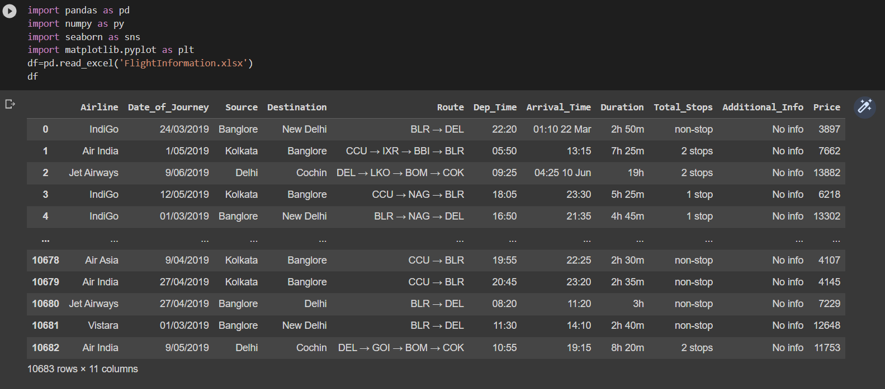
### Head
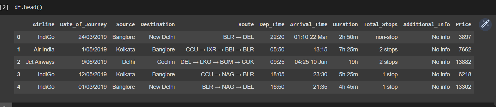
### Info
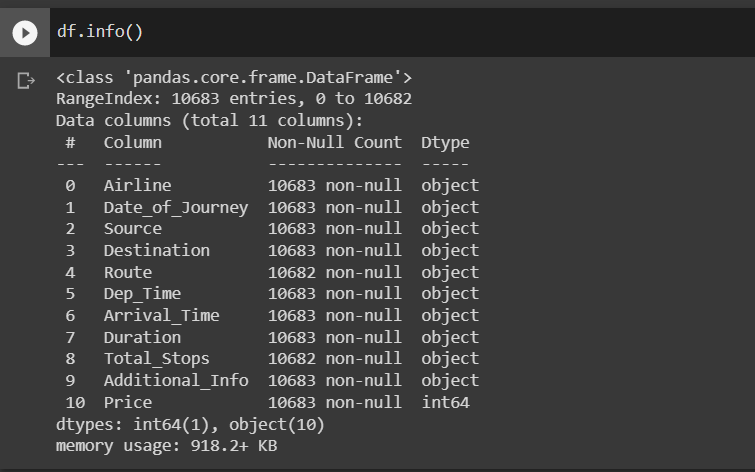
### Describe
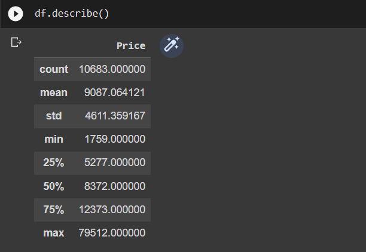
### Nullsum
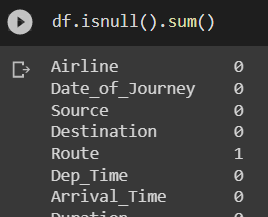
### Data Types
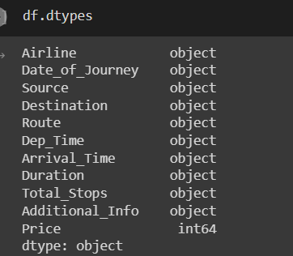
## NUMERICAL AND NUMERICAL
### Scatter plot
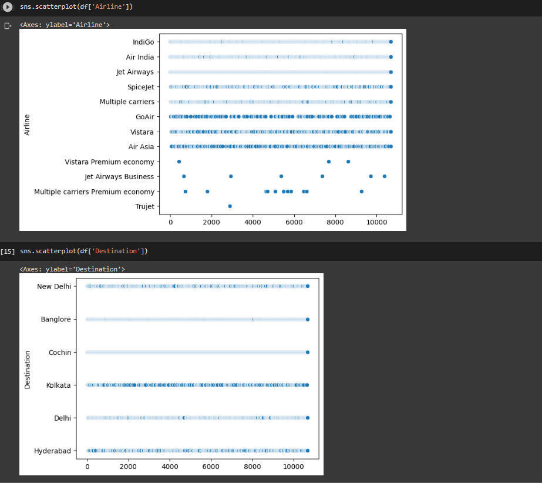
## NUMERICAL AND CATEGORICAL
### Bar plot
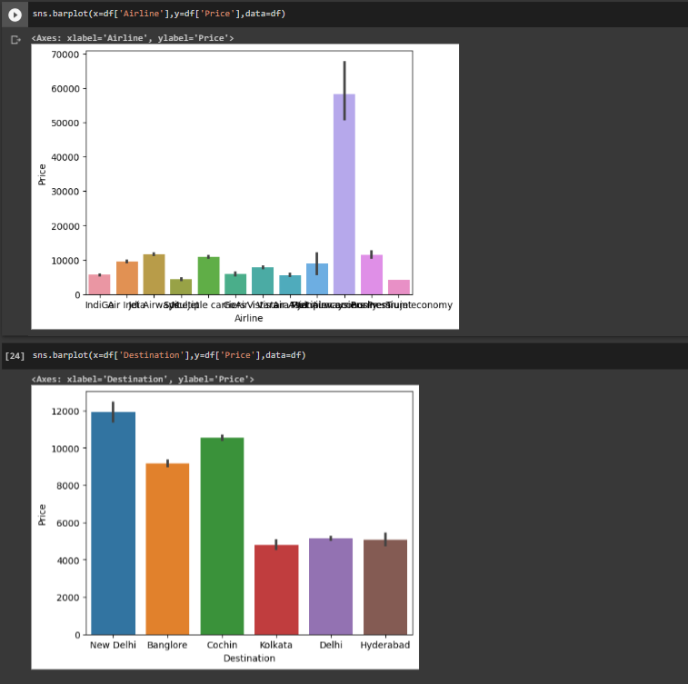
### Box plot
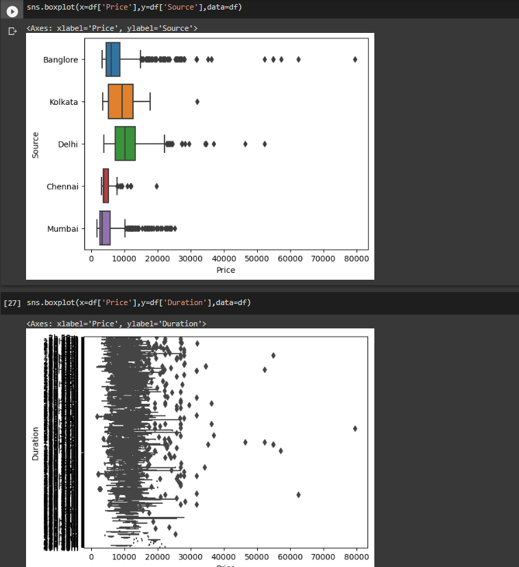
### Dis plot
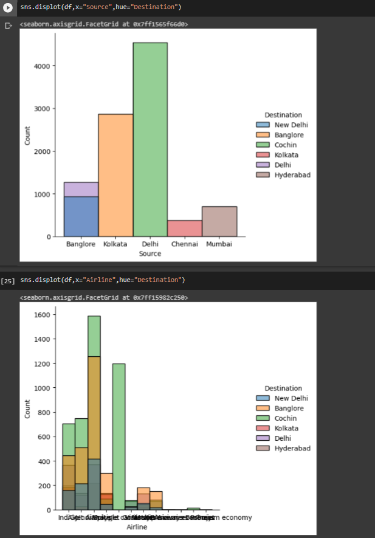
## MULTIVARIATE
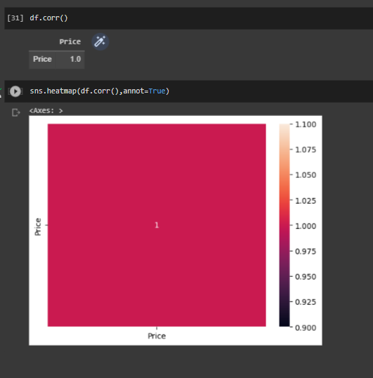
# Result
Thus the Bivariate and Multivariate analysis is observerd for the given data set.